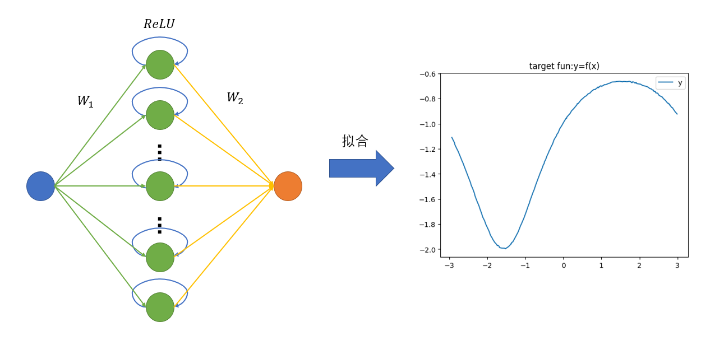
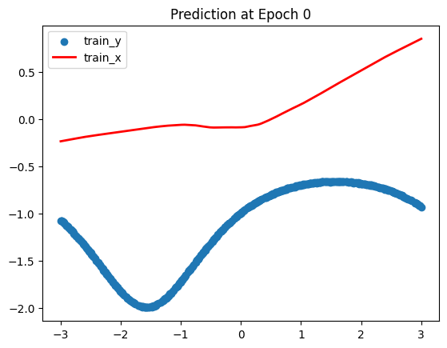
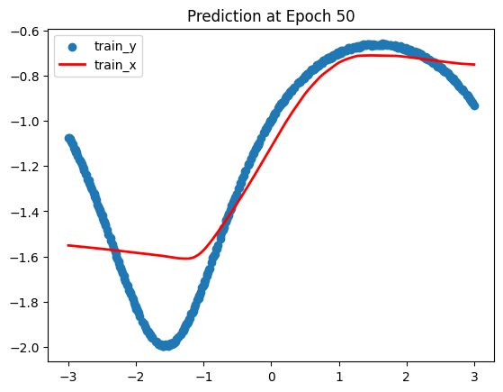
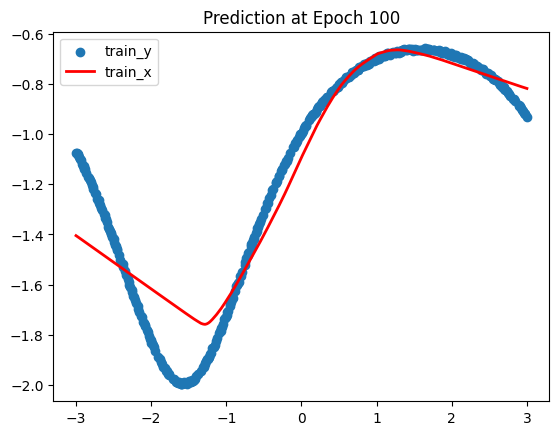
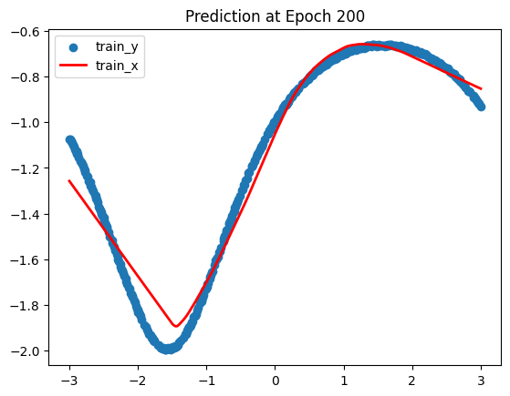
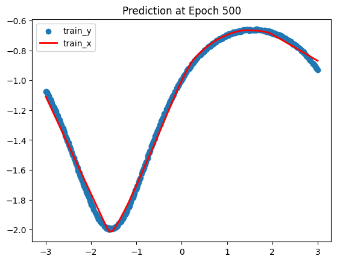
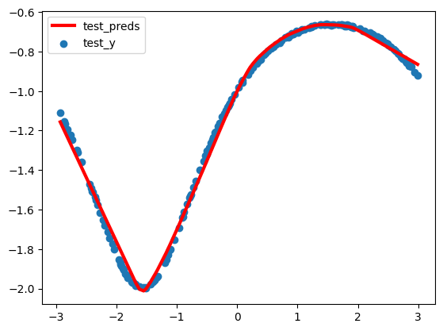

# 深度学习作业2-2 用两层ReLU网络模拟函数报告

2053965 岳彦伟

## 一、函数定义

本题的拟合目标函数为:

$$
f(x)=-\frac{2}{2+sin(x)} ,-3<x<3
$$

代码中定义如下：

```python
def target_fun(x):
    # 目标函数为-2/(2+sin(x))
    return -2/(2+np.sin(x)) + 0.01*np.random.rand(x.size).reshape(-1, 1)
```

## 二、数据采集

总数据集的自变量x是从-3到3的600个数据点

```python
x = np.linspace(-3, 3, 600)  # 所有数据
```

测试集数据从x中随机选取180个数据点

训练集数据为总数据集-测试集

生成数据的代码如下：

```python
def generate_dataset():
    # 生成数据集
    x = np.linspace(-3, 3, 600)  # 所有数据
    x_test = np.random.choice(x,int(600*0.3),replace=False)  # 测试数据
    x_test= np.sort(x_test)
    x_train = np.setdiff1d(x,x_test).reshape(-1,1)  # 训练数据
    x_test = x_test.reshape(-1,1)
    y_train = target_fun(x_train)
    y_test = target_fun(x_test)
    return (x_train,y_train),(x_test,y_test)
```

## 三、模型描述

### 3.1、numpy实现自动求导

#### 矩阵乘法自动求导

```python
class Matmul:
    def __init__(self):
        self.mem = {}
  
    def forward(self, x, W):
        h = np.matmul(x, W)
        self.mem={'x': x, 'W':W}
        return h
  
    def backward(self, grad_y):
        '''
        x: shape(N, d)
        w: shape(d, d')
        grad_y: shape(N, d')
        '''
        # y = w*x
        # grad_y = dL/dy
        # grad_x = dL/dx = dL/dy * dy/dx = grad_y*w.T
        # grad_W = dL/dw = dL/dy * dy/dw = x.T*grad_y
        x = self.mem['x']
        W = self.mem['W']
  
        ####################
        '''计算矩阵乘法的对应的梯度'''
        ####################
        grad_x = np.matmul(grad_y, W.T)
        grad_W = np.matmul(x.T,grad_y)
  
        return grad_x, grad_W
```

矩阵乘法的导数计算公式如下：

已知：

$$
y = w·x\\
grad_y = \frac{dL}{dy}\\
$$

输出：

$$
grad_x = \frac{dL}{dx} = \frac{dL}{dy}·\frac{dy}{dx} = grad_y·w^T\\
grad_w = \frac{dL}{dw} = \frac{dy}{dw}·\frac{dL}{dy} = x^T·grad_y\\
$$

求偏导的正确性可以用矩阵的大小得以验证

#### ReLU函数自动求导

```python
class Relu:
    def __init__(self):
        self.mem = {}
  
    def forward(self, x):
        self.mem['x']=x
        return np.where(x > 0, x, np.zeros_like(x))
  
    def backward(self, grad_y):
        '''
        grad_y: same shape as x
        '''
        ####################
        '''计算relu 激活函数对应的梯度'''
        ####################
        # y = max(0,x)
        # grad_x = dL/dy * dy/dx = grad_y*0/1
        x = self.mem['x']
        grad_x = (x>0).astype(np.float32) * grad_y # x是Array用三元表达式不方便
        return grad_x
```

ReLU函数如下：

$$
y = max(0,x) = \left\{
\begin{aligned}
& 0 &,x<0\\
& x &,x\geq 0 \\
\end{aligned}
\right.
$$

ReLU函数的求导公式如下：

已知：

$$
y = ReLU(x)\\
grad_y = \frac{dL}{dy}\\
$$

输出的梯度为：

$$
grad_x = \frac{dL}{dy}·\frac{dy}{dx} = \left\{
\begin{aligned}
&0 &,x<0\\
&grad_y&,x>0
\end{aligned}
\right.
$$

### 3.2、选择MSE损失函数

由于本问题为回归问题，因此选择平均平方损失作为本问题的损失函数。

平均平方损失函数（MSE）衡量模型预测值与实际值之间的差异程度。对于给定的预测值和真实值，MSE 的计算方法如下：

$$
MSE = \frac{1}{n} \sum_{i=1}^{n} (y_i - \hat{y}_i)^2
$$

其中，$y_i$ 是第 $i$ 个样本的真实值，$\hat{y}_i$ 是模型预测的值，$n$ 是样本数量。

MSE损失对模型预测值求导得：

$$
\begin{aligned}
&\frac{dL}{d\hat{y}_i}=\frac{2}{n}(\hat{y}_i-y_i)\\
\Longrightarrow &\frac{dL}{d\hat{y}} = \frac{2}{n}(\hat{y}-y) 
\end{aligned}
$$

### 3.3、构建两层的ReLU网络

基于先前numpy实现的自动求导代码，构建最简单的两层全连接网络，并以ReLU函数为激活函数，示意图如下：



其中，输入层向量为大小为N\*1，中间隐藏层向量大小为N\*640，输出层向量大小也为N\*1。

对应地，$w_1$的大小为2\*640(包含每个节点对应的偏置项)，$w_2$的大小为640*1

代码如下：

```python
class myModel:
    def __init__(self):
  
        self.W1 = np.random.normal(size=[1+1, 640])*0.1
        self.W2 = np.random.normal(size=[640, 1])*0.1
  
        self.mul_h1 = Matmul()
        self.mul_h2 = Matmul()
        self.relu = Relu()
  
    def forward(self, x):
        x = x.reshape(-1, 1)
        bias = np.ones(shape=[x.shape[0], 1])
        x = np.concatenate([x, bias], axis=1) # 增加偏置项
        self.h1 = self.mul_h1.forward(x, self.W1)
        self.h1_relu = self.relu.forward(self.h1)
        self.h2 = self.mul_h2.forward(self.h1_relu, self.W2)
  
    def backward(self, preds, y):
        self.h2_grad, self.W2_grad = self.mul_h2.backward(2*(preds-y)/y.shape[0])
        self.h1_relu_grad = self.relu.backward(self.h2_grad)
        self.h1_grad, self.W1_grad = self.mul_h1.backward(self.h1_relu_grad)
  
model = myModel()
```

## 四、拟合效果

### 4.1、结果展示

在训练过程中绘制不同Epoch下的训练集预测值和真实值拟合效果如下

* Epoch 0，MSE=1.716

  
* Epoch 50，MSE=0.033

  
* Epoch 100，MSE=0.016

  
* Epoch 200，MSE=0.006

  
* Epoch 500，MSE=0.001

  

可以观察到，模型随着不断训练，MSE Loss逐渐减小，在前50个Epoch后Loss就减小到随机初始化的2%，在200个Epoch后拟合程度已经较好，在500个Epoch完成后，训练数据的预测值和真实值拟合极佳，二者几乎吻合，误差极小。

最终，在测试集上，观察模型的拟合效果如下：


### 4.2、训练说明

两层ReLU网络虽然理论上能拟合任意的函数，然而其结构较为简单，在实践上拟合复杂函数有一定的困难。具体地，对于简单的二次函数、半个周期内的正弦函数均能很好地拟合。并且对于复杂函数需要加宽隐藏层宽度，增多训练轮次，调整学习率。对于二次函数这类简单的函数可能隐藏层宽度为16就足够了，对本目标拟合函数宽度则为几百，对于更复杂的函数更需要成千上万的宽度。

此外，在训练中发现，偏置项对于神经网络的表达能力十分重要，缺少偏置项时，很难拟合复杂函数。

因此，虽然说二层ReLU网络在理论上能拟合任意函数，但在实践中需要不断调整隐藏层宽度、学习率、训练轮次以适应复杂拟合函数。对于特别复杂的函数，不仅仅需要增加网络宽度，还要增加网络深度。且有研究表明，增加网络深度比增加网络宽度，在耗费同等计算量时，对很多问题更加有效。
